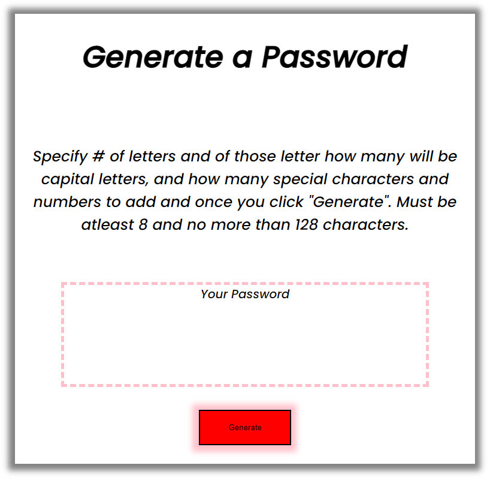
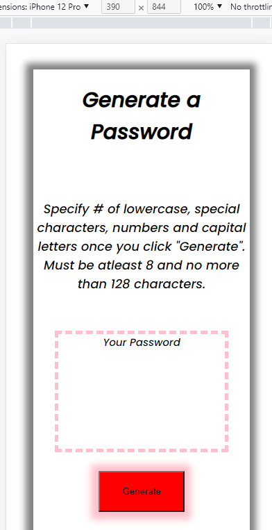

# Professional Portfolio

## Description

A basic password generator that randomly creates a string of lowercase, uppercase, special characters (IBM standard: !, @, #, $, %, ^, &, or *) and numbers. A prompt will ask for the number of letters and of those letters the number of uppercase capital letters, the number of special characters and finally the number of numbers to be added to the password. There are parameters such as the password must be atleast 8 characters and no more than 128. The password generator is compatible with desktop and mobile with adaptive css.

### Screenshots

### Deployed Website Link

https://algorithmnblues92.github.io/password_generator/